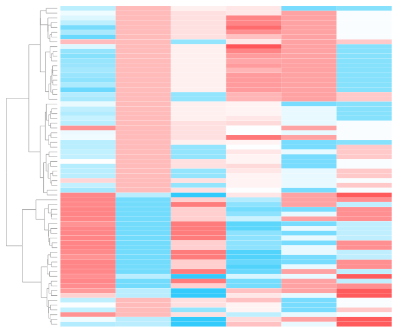

# Research

[ **[Research](/index.md)** ][ [Curriculum Vitae](/cv.md) ][ [Github](https://github.com/status-five) ][ [Contact](/contact.md) ]

---

I research computational methods in ecological data, specifically Metagenetic and Metabarcoding, associating community structure with the environment, as well as looking rare and pathogenic species in large amounts of data.  

 
`environmental variables influencing sample to sample simularity`

K-mer comparison methods that estimate distances between gnomic data can be used to generate environmental sample to sample distances in both metagenomic and metabarcoding applications. A pair-wise matrix of distances can be clustered via hierarchical methods. This De novo clustering of k-mer derived distances may describe the community structure of such samples, and may correlate with the environment. Such is the case with data correlated with soil measurements in the Atacama desert or data of shipping ports with sampling location from around the world. Some of the algorithms that can be leveraged to do this, like those using sketching (as is the case with Mash), suffix trees, or de Bruijn graphs show increased speed over original methods. Such methods can also be used to determine the presence or absence of a targeted species, as is shown with the search for the yeast C. Neoformans in 12634 18S metagenomic datasets. Available methods in k-mer analysis can be used in metagenomic and metabarcoding studies for the determination of significant subsets and for the presence absence of particular species. 

 
`12634 18S metagenomic datasets compared to eachother, colored by type of source, ie:soil vs. aquatic`

<meta name="keywords" content="David Molik, Molik, Metagenetic, Metabarcoding"/>
<meta name="description" content="David Molik's research interests: Expploring Metagenetic and Metabarcoding analysis"/>
<meta name="subject" content="david.molik.co : A Personal Webpage">

